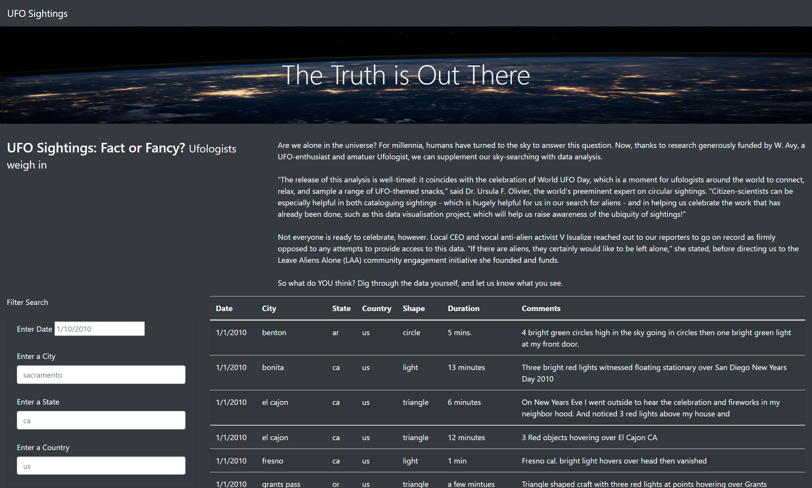
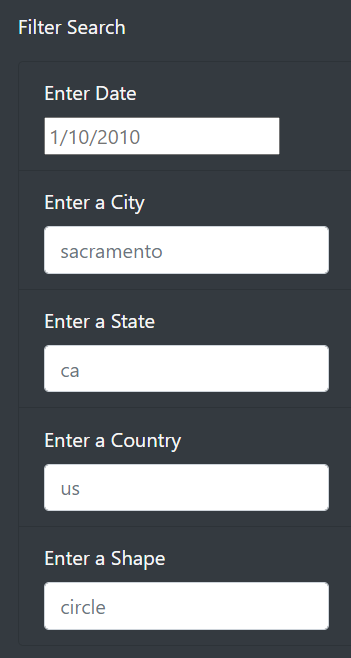

# UFOs!!!

# Overview of Project:

Everyone has at one time, or another seen something in the sky that they just couldn't recognize or make sense of. A lot of these bizarre experiences can be defined as a spotting of an Unidentified Flying Object (UFO). Not everyone reports these incidents or are believed. Luckily for us, we have a database that contains countless UFO sightings! So, if you’ve seen something weird in the sky… you’re not alone. Using JavaScript, I was able to turn this dataset into a functioning website where anyone can easily search for specific UFO sightings in any city! 

# Results:

To access this website, first download all the contents of this GitHub repository. Then open the index.html file. Once on the website, you can easily search the database by using the “Filter Search” section on the lefthand side. If you want to, you can search each category individually or find a specific UFO sighting by filling in all five categories. Your first option is “Enter Date.” The date format must be extremely specific in its spelling/formatting. Don’t include extra zeros in the date because this input must match the data within the data.js. For example, searching 1/2/2010 will being up a result, but 1/02/2010 won’t. The rest of the filter options (City, State, Country, and Shape) need to be done in under case and must match something existing in the dataset.

# Summary:

Our website works and looks amazing! However, there’s one major drawback of this webpage… unfortunately you must be aware of what you’re searching for. You can narrow your search down by using one of the filters at time, but if you get a syntax error in any of your filters the results will be blank. An improvement that could be made would be to have the ability to select from options within the filters instead of manually typing it in. If a client doesn’t know what shapes to look for, they might have a hard time using that filter. Also having a button would be nice. I don’t believe that the Filter Search is currently super intuitive. Since there’s numerous boxes being applied to the data all at once, a client might not realize that all the boxes are working together simultaneously. Having a button that says “Apply” would help tie these functions together in an easy way to understand. 
